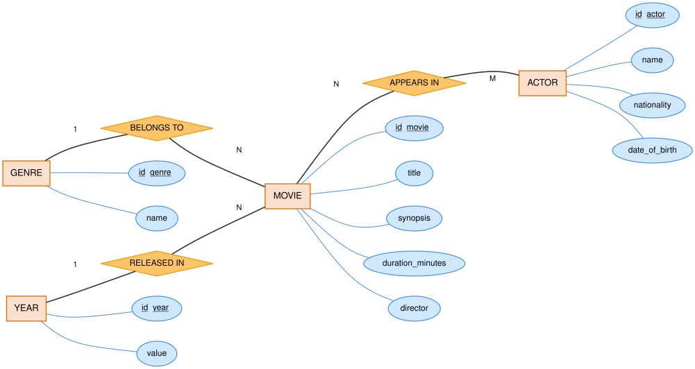
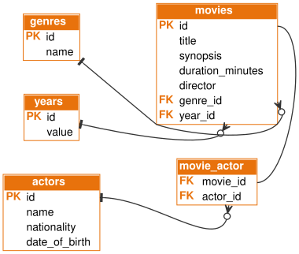

# 🎬 Movies API — Movies REST API

REST API for managing a movie catalog, built as a project for the
**Factoría F5** bootcamp. It supports CRUD operations on movies and lets you
search them by title or genre, while also modeling the related **genre**,
**year** and **actors** entities.

The project follows the same Spring Boot fundamentals shown in class
(`cs-p5-digital-academy-java-spring-fundamentals`): lightweight controllers,
a service layer with generic interfaces, DTOs as `record`s, static mappers
and a global exception handler.

## Technologies

- Java 21
- Spring Boot 3.3.4 (Spring Web, Spring Data JPA, Bean Validation)
- H2 database (in-memory, default profile) / MySQL (optional profile)
- Maven
- JUnit 5 + Mockito + AssertJ (tests)
- Postman (test collection included)
- Docker / Docker Compose (optional, to run the API + MySQL without installing anything)

## Project structure

**Feature-based** organization (each entity groups its own classes), just
like the examples shown in class (`country/`, `pet/`...), instead of
grouping by technical layer:

```
src/main/java/org/factoriaf5/
├── App.java                    # Main class (@SpringBootApplication)
├── globals/                    # Pieces shared by the whole API
│   ├── GlobalExceptionHandler.java   # Centralized @RestControllerAdvice
│   ├── ErrorResponse.java            # Uniform JSON error body
│   └── exceptions/
│       ├── ApiException.java
│       ├── ApiNotFoundException.java  # -> 404
│       └── ApiConflictException.java  # -> 409
├── implementations/             # Reusable generic interfaces
│   ├── InterfaceGenericGetService.java   # getEntities(), getById()
│   └── InterfaceGenericEditService.java  # storeEntity(), updateEntity(), deleteEntity()
├── movie/                       # Central entity
│   ├── MovieController.java
│   ├── MovieEntity.java
│   ├── MovieRepository.java
│   ├── MovieServiceImpl.java
│   ├── InterfaceMovieService.java        # extra method: search()
│   ├── dtos/ (MovieDTORequest, MovieDTOResponse — records)
│   └── mappers/MovieMapper.java          # static mapper
├── genre/     # same pattern: Controller, Entity, Repository, ServiceImpl, dtos/, mappers/
├── year/      # same pattern
└── actor/     # same pattern

src/main/resources/
├── application.properties          # General configuration + active profile
├── application-h2.properties       # Default profile: in-memory H2
├── application-mysql.properties    # Optional profile: MySQL
├── application-h2file.properties   # Extra profile: H2 backed by a file (see DBeaver)
└── data.sql                        # Sample data loaded on startup

src/test/java/...                   # Unit tests
docs/diagrams/                      # Entity-relationship diagrams (Chen and crow's foot)
postman/                            # Ready-to-import Postman collection
Dockerfile                          # API image (multi-stage build)
docker-compose.yml                  # API + MySQL, ready to run with one command
```

A request always flows `Controller → Service → Repository → Database`.
Each `ServiceImpl` implements the generic interfaces from `implementations/`
for the common (CRUD) operations, plus its own interface when it needs
something specific (like `InterfaceMovieService.search(...)`). DTOs are
immutable `record`s, mappers are static classes (no Spring bean, same as in
class) and `GlobalExceptionHandler` centralizes every error into a
consistent JSON response.

## Data model

The central entity is **Movie**, related to **Genre** and **Year** (1:N
relations) and to **Actor** (N:M relation through a join table).

| Relation | Type | Description |
|---|---|---|
| Genre → Movie | 1:N | A genre can have many movies; each movie belongs to a single genre. |
| Year → Movie | 1:N | A year can have many movies released in it; each movie is released in a single year. |
| Movie ↔ Actor | N:M | A movie has several actors and an actor appears in several movies (join table `movie_actor`). |

### Chen diagram



### Crow's foot diagram



### Table schema

```
genres(id PK, name)
years(id PK, year_value)
actors(id PK, name, nationality, date_of_birth)
movies(id PK, title, synopsis, duration_minutes, director,
       genre_id FK -> genres.id, year_id FK -> years.id)
movie_actor(movie_id FK -> movies.id, actor_id FK -> actors.id)
```

## Installation and running

### Prerequisites

- JDK 21 or later
- Maven 3.9+

### Steps

```bash
# 1. Clone the repository
git clone https://github.com/ikerardi-dev/api-movies.git
cd api-movies

# 2. Compile and run the tests
mvn clean test

# 3. Start the application (uses in-memory H2 by default, "h2" profile)
mvn spring-boot:run
```

The API is available at **http://localhost:8080**, with the version prefix
`api-endpoint=api/v1` configured in `application.properties` (same as in the
class example), i.e.: `http://localhost:8080/api/v1/...`.

On startup, the schema is recreated and sample data is loaded automatically
(6 genres, 6 years, 10 actors and 6 movies) defined in `data.sql`, so the API
can be tried out without entering any data by hand.

- **H2 console**: http://localhost:8080/h2-console
  (JDBC URL: `jdbc:h2:mem:moviesdb`, user `sa`, no password)

### Optional use with MySQL

If you'd rather persist the data in MySQL instead of H2:

```bash
# 1. Create the database (or let createDatabaseIfNotExist create it)
mysql -u root -p -e "CREATE DATABASE moviesdb;"

# 2. Adjust the username/password in src/main/resources/application-mysql.properties

# 3. Run with the "mysql" profile
mvn spring-boot:run -Dspring-boot.run.profiles=mysql
```

### Viewing the H2 database in DBeaver (without Docker or MySQL)

Extra profile (not covered in class, added to be able to inspect the data
with DBeaver without setting up Docker/MySQL): H2 backed by a file instead
of memory.

```bash
mvn spring-boot:run -Dspring-boot.run.profiles=h2file
```

This creates the file `./data/moviesdb.mv.db`. In DBeaver, create an **H2**
connection pointing (with a manual URL) to:

```
jdbc:h2:file:<absolute_path_to_the_project>/data/moviesdb;AUTO_SERVER=TRUE
```

with user `sa` and no password. The API must still be running for DBeaver to
be able to connect (`AUTO_SERVER` mode).

## Running with Docker

The repository includes a `Dockerfile` (builds and packages the API) and a
`docker-compose.yml` that starts **the API + a MySQL database** together,
without needing to install Java, Maven or MySQL on your machine.

```bash
docker compose up --build
```

This starts:

- `movies-mysql` → MySQL 8.0 on `localhost:3306`, database `moviesdb`
  (user `root`, password `root`), with the data persisted in a Docker volume
  (`mysql_data`) so it isn't lost on restart.
- `movies-api` → the Spring Boot API on `localhost:8080`, automatically
  connected to that MySQL instance (`mysql` profile).

To stop it: `docker compose down` (add `-v` if you also want to delete the
volume's data).

### Viewing the database in DBeaver (with Docker)

With `docker compose up` running, create a new connection in DBeaver:

| Field | Value |
|---|---|
| Connection type | MySQL |
| Host | `localhost` |
| Port | `3306` |
| Database | `moviesdb` |
| User | `root` |
| Password | `root` |

This lets you see the `movies`, `genres`, `years`, `actors` and
`movie_actor` tables directly, already loaded with the sample data.


## Endpoints

All endpoints return and expect JSON. Base prefix: `/api/v1`.

### Movies (`/api/v1/movies`)

| # | Method | Endpoint | Description | Success code |
|---|--------|----------|--------------|--------------|
| 1 | `GET` | `/api/v1/movies` | Gets all movies | 200 OK |
| 2 | `GET` | `/api/v1/movies/{id}` | Gets a movie by its id | 200 OK / 404 Not Found |
| 3 | `POST` | `/api/v1/movies` | Adds a new movie | 201 Created |
| 4 | `PUT` | `/api/v1/movies/{id}` | Updates an existing movie | 200 OK / 404 Not Found |
| 5 | `DELETE` | `/api/v1/movies/{id}` | Deletes a movie | 204 No Content / 404 Not Found |
| 6 | `GET` | `/api/v1/movies/search?title=...&genre=...` | **Extra endpoint (findBy):** searches movies by title and/or genre (optional, combinable parameters) | 200 OK |

#### Example — create movie (`POST /api/v1/movies`)

```json
{
  "title": "Interstellar",
  "synopsis": "A group of explorers travel through a wormhole in search of a new home for humanity.",
  "durationMinutes": 169,
  "director": "Christopher Nolan",
  "genreId": 1,
  "yearId": 4,
  "actorIds": [5]
}
```

#### Example — response

```json
{
  "id": 7,
  "title": "Interstellar",
  "synopsis": "A group of explorers travel through a wormhole in search of a new home for humanity.",
  "durationMinutes": 169,
  "director": "Christopher Nolan",
  "genre": { "id": 1, "name": "Science Fiction" },
  "year": 2014,
  "actors": [
    { "id": 5, "name": "Leonardo DiCaprio", "nationality": "American", "dateOfBirth": "1974-11-11" }
  ]
}
```

#### Example — extra `findBy` endpoint

```bash
curl "http://localhost:8080/api/v1/movies/search?title=matrix"
curl "http://localhost:8080/api/v1/movies/search?genre=horror"
curl "http://localhost:8080/api/v1/movies/search?title=star&genre=sci"
```

Internally it uses a Spring Data JPA repository method based on the
`findBy...` convention (`findByTitleContainingIgnoreCase`,
`findByGenre_NameContainingIgnoreCase`), combined into a single `@Query` to
allow filtering by both criteria at once.

### Supporting endpoints

Needed to be able to create movies with their relations (create
genres/years/actors before referencing them by id):

| Resource | Endpoints |
|---|---|
| Genres | `GET /api/v1/genres`, `GET /api/v1/genres/{id}`, `POST /api/v1/genres`, `PUT /api/v1/genres/{id}`, `DELETE /api/v1/genres/{id}` |
| Years | `GET /api/v1/years`, `GET /api/v1/years/{id}`, `POST /api/v1/years`, `PUT /api/v1/years/{id}`, `DELETE /api/v1/years/{id}` |
| Actors | `GET /api/v1/actors`, `GET /api/v1/actors/{id}`, `POST /api/v1/actors`, `PUT /api/v1/actors/{id}`, `DELETE /api/v1/actors/{id}` |

### Status codes used

| Code | When it's returned |
|---|---|
| `200 OK` | Query or operation completed successfully |
| `201 Created` | Resource created successfully |
| `204 No Content` | Resource deleted successfully |
| `400 Bad Request` | Invalid input data (validation) |
| `404 Not Found` | The requested resource does not exist |
| `409 Conflict` | Trying to create a duplicate resource or violating a business rule (e.g. deleting a genre with movies associated with it) |
| `500 Internal Server Error` | Unexpected server error |

### Error format

Every error returns a consistent JSON body thanks to the
`GlobalExceptionHandler` (`@RestControllerAdvice`, shown in class):

```json
{
  "timestamp": "2026-08-25T10:15:30",
  "status": 404,
  "error": "Not Found",
  "message": "Movie not found with id 99",
  "path": "/api/v1/movies/99"
}
```

## Testing the API with Postman

A ready-to-import collection is included at
[`postman/movies-api.postman_collection.json`](postman/movies-api.postman_collection.json)
with the 6 movie endpoints and the supporting genre/year/actor endpoints.

1. Open Postman → **Import** → select the collection file.
2. The `base_url` variable already points to `http://localhost:8080`.
3. Run the requests in order (some of them depend on the sample data loaded
   by `data.sql`).

## Tests

```bash
mvn test
```

Includes a Spring context startup test (`AppTests`) and unit tests for the
movie service layer (`MovieServiceImplTest`) with the repositories mocked
using Mockito.

## Design decisions relative to the class notes

The project closely follows the fundamentals shown in
`cs-p5-digital-academy-java-spring-fundamentals` (layered architecture,
generic interfaces, `record` DTOs, static mappers, `@RestControllerAdvice`).
A couple of points where what was shown in class is generalized or slightly
improved, with the reasoning behind each:

- **Exceptions centralized under `globals/exceptions`** instead of one
  `XxxException`/`XxxExceptionNotFound` pair per entity: with 4 entities
  (Movie, Genre, Year, Actor), duplicating the same pair of classes 4 times
  adds nothing — they're generalized into `ApiException`/`ApiNotFoundException`/
  `ApiConflictException`, reusable by all of them, applying the same
  technique (`@ResponseStatus` + `@RestControllerAdvice`).
- **Search endpoint using `@RequestParam`** (`GET /movies/search?title=...`)
  instead of `GET` with `@RequestBody`: a `GET` shouldn't carry a body
  according to HTTP/REST semantics, so query params were used instead — more
  idiomatic and just as easy to test.

## Author

**Iker** — [@ikerardi-dev](https://github.com/ikerardi-dev)

Project developed for the Factoría F5 bootcamp.
